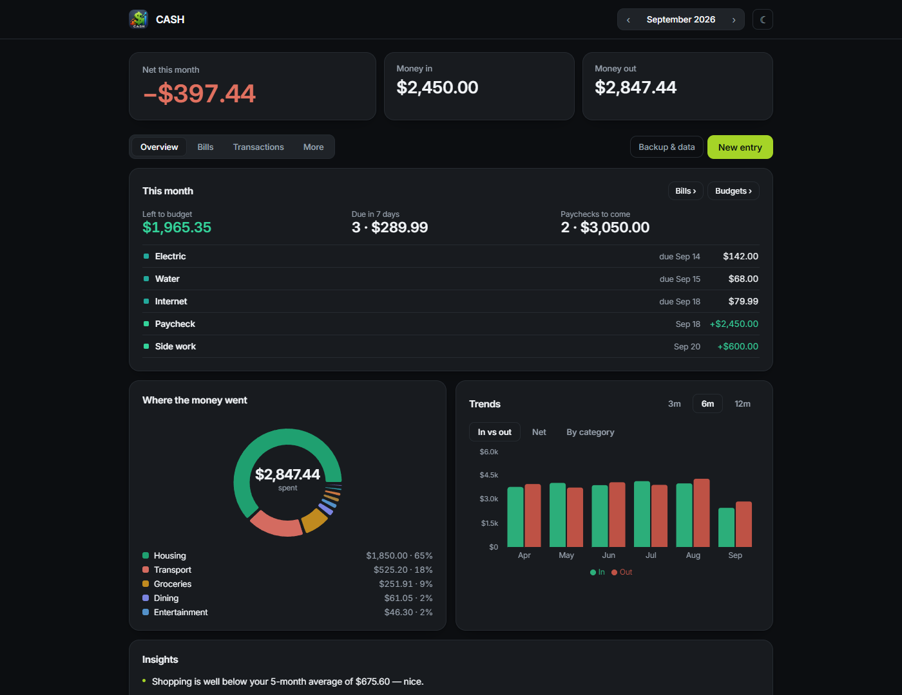
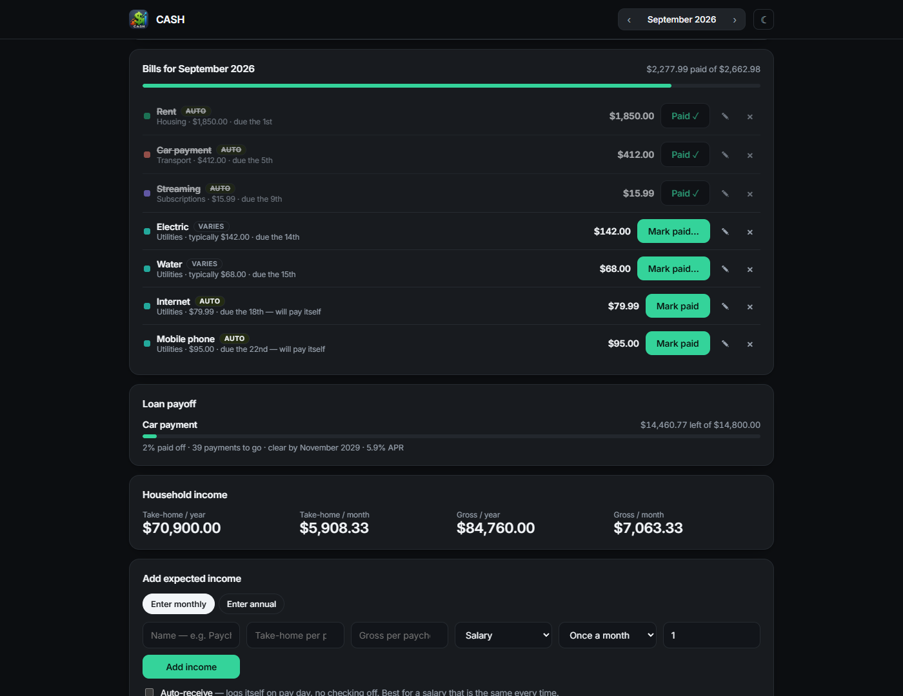
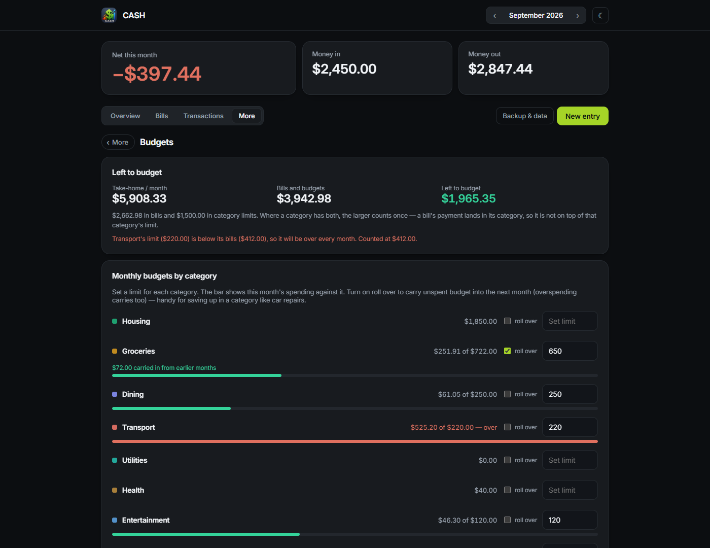

# CASH — Count All Spending Habits

[](https://github.com/rhc52980/CASH_Budget_Tracker/releases/latest)
[](https://github.com/rhc52980/CASH_Budget_Tracker/releases)
[](https://github.com/rhc52980/CASH_Budget_Tracker/actions/workflows/ci.yml)
[](LICENSE)




A personal budget that lives on your own computer. Enter your bills and income
once, and every month CASH tells you what is due, what is about to land, and
what is left to budget.

No account. Nothing uploaded. Your ledger is a plain JSON file in the CASH
folder, and the only thing that can read it is a small server bound to your
own machine.

## Why it exists

Most budgeting apps want your bank login and a subscription, and keep your
finances on someone else's server. CASH wants neither. It is built for one
household, on one machine, with the whole ledger in a file you can open in a
text editor, copy to a USB stick, or delete.

The trade-off is honest: there is no bank sync. You enter things, or import a
statement CSV. In return you know exactly where every number came from.

## A look around

Bills are entered once. Fixed ones pay themselves on the due day; ones that
vary ask what you were actually charged. A loan shows what is left and when it
clears, and your income sits underneath as an annual and monthly total.



Budgets start with the number that matters — what is left of take-home once
bills and category limits are spoken for — and tell you when a limit is smaller
than the bills that land in it.



## Getting started on Windows

1. Install [Node.js](https://nodejs.org) — download the **LTS** installer and
   accept the defaults. You only do this once.
2. Download this project (green **Code** button → **Download ZIP**) and extract
   it anywhere — Downloads is fine.
3. Double-click **`Install-CASH.bat`**.

It doesn't matter where you extracted it. The installer **copies CASH to
`C:\CASH`**, builds it there, and puts an icon on your desktop. Once it
finishes you can delete the folder you downloaded.

To install somewhere else, pass a path:

```
Install-CASH.bat D:\Apps\CASH
```

| Double-click | What it does |
| --- | --- |
| `Install-CASH.bat` | First-time setup. Run once. |
| **desktop icon** / `CASH.vbs` | Starts CASH silently — no window. |
| `Stop-CASH.bat` | Shuts CASH down. |
| `Update-CASH.bat` | Fetches the newest version and rebuilds. |
| `Start-CASH.bat` | Same as the icon, but shows a window. Useful if something breaks. |
| `Create-Shortcut.bat` | Re-creates the desktop icon if you move the folder. |

Using the desktop icon, CASH starts in the background with no console window and
your browser opens at <http://localhost:4173>. It keeps running until you run
`Stop-CASH.bat`, sign out, or restart — closing the browser tab does not stop it,
so you can come back to the tab any time.

CASH uses **port 4173**. If it is busy the launcher stops with an explanation
rather than quietly moving to another port.

Updating never touches your ledger: `data/` is left alone by installs, updates
and rebuilds. After an update the app may offer a **Refresh** button — click it
to load the new version.

### Install it as a desktop app

With CASH open in Chrome or Edge, click the install icon at the right of the
address bar (a monitor with a downward arrow), or use the ⋮ menu →
*Cast, save, and share* → *Install page as app*. It then lives in your Start
menu and opens in its own window. You still need to run `Start-CASH.bat` first,
because the app and your ledger are both served from your own machine.

## Getting started on Linux

1. Install Node.js — `sudo apt install nodejs npm` on Debian/Ubuntu,
   `sudo dnf install nodejs npm` on Fedora, `sudo pacman -S nodejs npm` on Arch.
2. Download the **`.tar.gz`**, extract it anywhere, and run the installer:

```
tar -xzf CASH-*-linux.tar.gz
cd CASH_Budget_Tracker
./install.sh
```

Use the `.tar.gz` rather than the `.zip` on Linux: zip archives cannot store the
executable bit, so the scripts arrive unrunnable. If you only have the zip, start
it with `bash install.sh` instead — no `chmod` needed.

It copies CASH to `~/.local/share/cash`, builds it, installs the icon and adds
CASH to your applications menu. Then delete the folder you downloaded. Nothing
is installed system-wide and nothing needs `sudo`.

To install somewhere else, pass a path:

```
./install.sh ~/apps/cash
```

| Script | What it does |
| --- | --- |
| `install.sh` | First-time setup. Run once. Takes an optional install path. |
| `start.sh` | Starts CASH in the background and opens it. Same as the menu entry. |
| `stop.sh` | Shuts it down. |
| `update.sh` | Fetches the newest version and rebuilds. |

(`cash-common.sh` is shared helper code the others source; you never run it
directly. `cash.desktop.in` is the menu-entry template `install.sh` fills in.)

CASH uses **port 4173**. Set `CASH_PORT` if you need a different one; the ledger
file is the same either way.

## Where your data lives

Your ledger is a plain JSON file inside the CASH folder:

```
<install folder>/data/ledger.json
```

CASH runs a small local server (`server.js`, bound to 127.0.0.1 only) that owns
that file — a browser page cannot write to disk on its own. Writes go to a temp
file and are renamed into place, so a crash mid-save leaves the previous ledger
intact, and anything that is not valid JSON is refused rather than persisted.

Timestamped copies are kept in `data/backups/`, at most one every six hours and
up to 30 of them. **Copying the CASH folder now takes your data with it**, and
clearing your browser no longer affects the ledger.

`data/` is gitignored, so your finances are never committed or included in a
release archive.

## Versioning

The version shown in the bottom-right corner of the app comes from
`package.json`. Bump it there when you make a change worth marking; it flows to
the footer, the Backup & data panel, the launcher banner, and every exported
backup file.

## For developers

```
npm install
npm run dev      # dev server on :5173
npm test         # unit and component tests (vitest + jsdom)
npm run build    # production bundle in dist/
npm run preview  # serve the production build on :4173
```

Built with React + Vite; charts by Recharts. CASH is not hosted — pushes to
`main` only run the tests and build. See `ARCHITECTURE.md` for architecture notes.

To cut a release, bump `version` in `package.json`, run
`npm install --package-lock-only`, commit, then tag it:

```
git tag v1.6.0 && git push origin v1.6.0
```

The Release workflow builds the same zip and tarball `make-release.sh` makes
locally and attaches them to a GitHub release. The tag must match
`package.json`, or the workflow refuses.

Bug reports and feature requests: [open an issue](https://github.com/rhc52980/CASH_Budget_Tracker/issues).
The Feedback link in the app's footer goes to the same place.

## Features

- **Overview** — spending-by-category donut, recent entries, and a Trends chart
  with three views (in vs out, net, by category) over 3, 6, or 12 months
- **Bills** — recurring monthly bills with due days; mark them paid each month and
  the payment is logged as an expense. Tick **auto-pay** for bills that leave your
  account on their own — a car loan, rent, a subscription — and CASH logs them for
  you on the due day instead of waiting to be checked off.
- **Loan payoff** — tick **track payoff** on a bill and give it the balance owed
  and interest rate. CASH shows what is left, how many payments remain, and the
  month it clears — interest is charged before principal, so the figures are real
  rather than a plain subtraction.
- **Income** — add each paycheck once with how often it arrives: monthly, twice a
  month, every two weeks, or weekly. Enter it per paycheck or as an annual figure,
  with an optional gross amount alongside take-home. Tick **auto-receive** and it
  logs itself on pay day. A **Household income** card keeps the annual and monthly
  totals in view.
- **This month** — the home screen opens with what is left to budget, bills due in
  the next seven days (or overdue, in red), and paychecks still to land.
- **Budgets** — monthly limit per category with progress bars, over-budget warnings,
  and optional rollover that carries unspent budget (or overspending) into the next
  month. **Left to budget** shows take-home minus bills and limits, and flags a
  category whose limit is smaller than its bills.
- **Accounts** — checking, savings, cash, credit cards and loans, each with a live
  balance, plus your net worth. Transfers move money between your own accounts
  without counting as income or spending.
- **Reconcile** — press **Check** on an account, tick off what has appeared on your
  statement and enter the bank's balance. The difference tells you whether anything
  is missing or double-counted.
- **Insights** — category spending vs your recent average, end-of-month pace
  projection, largest expense, and savings rate
- **Goals** — savings goals you can fund incrementally
- **Transactions** — full monthly ledger with search, type/category filters, inline editing, and delete
- **Split entries** — divide one receipt across several categories in the add form
- **Backup & data panel** — export/restore backup files, see where the ledger
  file lives, and roll back to any of the automatic on-disk backups
- **CSV import** — load a bank statement export; columns are auto-detected, categories
  guessed from merchant names, and likely duplicates flagged before anything is saved.
  Corrections are remembered per merchant, so each statement lands better sorted than
  the last — and store numbers are ignored, so KROGER #442 and KROGER #118 count as one shop.
- **Undo** — deletions, restores and imports show an Undo button for a few seconds
- **Year view** — annual totals, net by month, category breakdown, and year notes
- **Custom categories** — add your own expense categories with a color of your choice
- **Appearance** — Light, Dark, Midnight (true black for OLED), High contrast, or
  Follow system, plus seven accent colours (Lime by default, sampled from the
  logo artwork); each theme has its own chart palette validated for colourblind
  separation against that background
- **Mobile-first on phones** — bottom tab bar and a floating add button under 640px
- **Backup nudges** — a gentle reminder when your last export is more than 30 days old
- **Feedback link** — a Feedback link in the footer opens the project's GitHub
  Issues page for bug reports and feature requests. The repository must be public
  with Issues enabled for anyone other than the owner to reach it; the URL lives in
  `FEEDBACK_URL` in `src/constants.js`.
- **Installable PWA** — add it to your phone or desktop; works offline (production build)

## What it can't do

- **No bank sync.** Nothing connects to your bank. You enter entries or import a
  statement CSV.
- **One household, one machine.** There is no login, no sync between devices, and
  no sharing. The ledger is a file; copy the folder to move it.
- **Not a tax tool.** Gross income is recorded for reference only; nothing is
  calculated from it.
- **Localhost only.** The server binds to 127.0.0.1 and will not serve the network.
  That is deliberate, and there is no option to change it.

## Requirements

- Node.js 18 or newer (the LTS installer is fine)
- Windows 10/11, or a Linux desktop with a browser
- Chrome, Edge or Firefox

## Licence

MIT — see [LICENSE](LICENSE).
